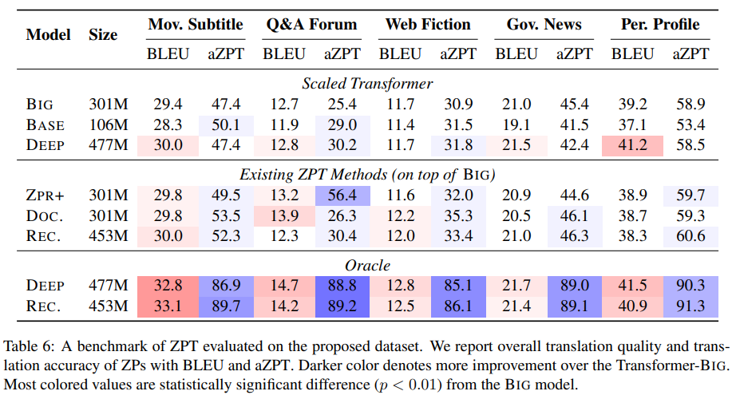
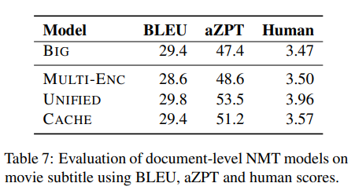

# mZPRT

Multi-domain Zero Pronoun Recovery and Translation Dataset

### **Catalog** 
    .
    ├── mt                  # Machine translation task
    │   ├── data
    │   ├── scipts
    │   ├── model
    ├── zpr                 # Zero pronoun recovery task
    │   ├── data
    │   ├── ZPR
    │   ├── model
    │   ├── scripts
    ├── zpt                 # Zero pronoun translation task
    │   ├── Reconstructor
    │   ├── Context-aware
    └── README.md

### Details   
Here are the components to reproduce the main results in our paper.  

1. **Base**,**Big**,**Deep** are the context-agnostic model,  plz refer to mt for more details.
2. **Big** model is the basic model of ZPR+. We first train a zpr model (via the code in zpr dir), than use it to recovery the omitted ZP in the testset and inferece it with **Big** model.
3. **Big** model is the basic model of ZPT method, including context-aware systems and reconstructor.   

To reproduce the result in following Table, Plz refer to zpt dir:   

   