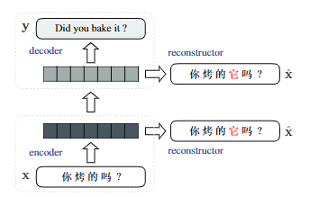

## ReConstructor

### Models
1. ReConstructor, a model proposed by Wang et al. AAAI 2018


### Usage:

#### Preparation
1. Data for ReConstructor model. We use the weaklable data to train our ReConstructor model. Data is release by Wang, and can be found [here](https://github.com/longyuewangdcu/tvsub) 
```bach
# make data
1. python ../scripts/turn_dp_back2original.py -i [original] -o [outputs] -z [data_dp] 
1.1 python ~/1_testset_mzprt/scripts/make_mt_data.py -i [input] -o [output] -z # get the target data of reconstructor.


2. fairseq-preprocess -s zh -t en --trainpref train_zp --validpref valid_zp --testpref test_zp --only-source --workers 20 --destdir TMP
# rename and move to the data dir for training baseline system. e.g.
3. mv TMP/train.zh-en.zh.bin SAN/train.zp.zh-en.zh.bin
# finally, we give a data-bin like this:
    .
    ├── train.zh-en.en.bin   
    ├── train.zh-en.en.idx   
    ├── train.zh-en.zh.bin   
    ├── train.zh-en.zh.idx        
    ├── train.zp.zh-en.zh.bin   
    ├── train.zp.zh-en.zh.idx 
    ├── valid.zh-en.en.bin   
    ├── valid.zh-en.en.idx    
    ├── valid.zh-en.zh.bin   
    ├── valid.zh-en.zh.idx 
    ├── valid.zp.zh-en.zh.bin   
    ├── valid.zp.zh-en.zh.idx 
    └── ...
```
The context-aware models are trained on two-stage training process. Therefore, we should training a conventional Transformer first.
1. Plz refer to [MT](../../mt/README.md) to train the baseline
2. --pretrained-checkpoint (shell script is the SPM=) baseline_checkpoint.pt # adding this to load the parameters from sent-level checkpoint

#### Training model
1. To get the Reconstructor model, we could follow this training step, `train a MT model -> tuning to Reconstructor -> tuning back to MT'.
```bash
# training on MT data
sh start_mv_zpt.sh
# tuning on Reconstructor data
sh start_mv.sh
# tuning on MT data
sh start_mv_zpt.sh
````

However, this training process is not stable. Sometime may lead to lower quality on translation. Therefore, we switch to the follow training process:

```bash
# training on movie subtitle,reconstructor
sh start_mv.sh
# (Option) you cloud you the script to prune the previous checkpoint into MT format. Than, move the checkpoint_last.pt to save dir in next step.
python ./Modify_Rec2MT.py -i chechpoint_best.pt -o checkpoint_last.pt 
# training on MT data
sh start_mv_zpt.sh
```

Using this way, the inference step is the same as conventional MT.