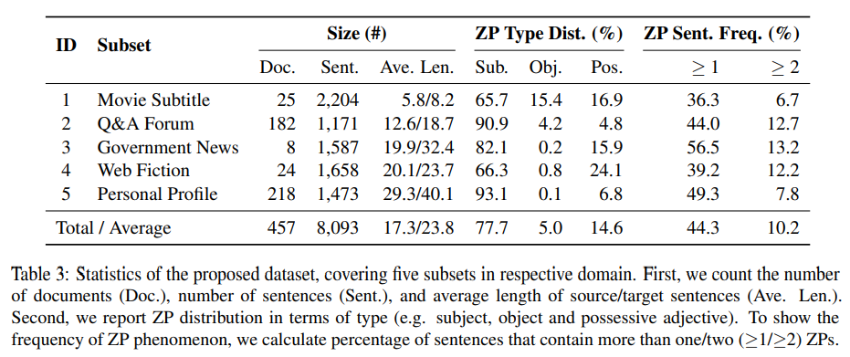

# **mZPRT**
Multi-domain Zero Pronoun Recovery and Translation Dataset

### **Citation**

Title: [A Benchmark for Zero Pronoun Recovery and Translation]()

If you use this benchmark, Please cite our paper:

```bibtex
@inproceedings{xxxxx,
  title={A Benchmark for Zero Pronoun Recovery and Translation},
  author={Mingzhou Xu  and Longyue Wong, Derek F. Wong, Hongye Liu Linfeng Song, Lidia S. Chao,Shuming Shi and Zhaopeng Tu},
  booktitle={xxxx},
  year={2022},
}
```

### LICENSE
See `LICENSE`. We follow the data licensing plan as the same as the WMT benchmark. 

### **Statistic**


We release a benchmark for Zero Pronoun Recovery and Translation, this benchmark contains the zero pronoun annotations (handcraft) from five different source. 

### **Catalog** 

    .
    ├── 1_testset_mzprt            # Our benchmark testset
    │   ├── processed              # tokenized and BPEed testset
    │   │   ├── context-agnostic   # original/oracle testset for sent-level
    │   │   ├── context-aware      # original/oracle testset for doc-level
    │   ├── raw                    # raw testset for each domain
    │   ├── script                 # script for preprocessing and scoring bleu
    ├── 2_metric_azpt              # Our evaluation metric
    │   ├── aZPT                   # evaluation toolkit
    │   ├── aZPT_output            # output files in details of aZPT
    │   ├── human_score            # human judgements on 6 systems
    │   ├── scirpts                # scripts for getting alignment
    ├── 3_comparative_models       # Bechmark related resources
    │   ├── mt                     # Machine translation task
    │   │   ├── data               # training data for MT baseline
    │   │   │   ├── FT_dataset     # domain-specific data for QA Forum and Web Fiction
    │   │   │   ├── Movie_Subtitle # training data for Movie_Subtitle
    │   │   │   ├── WMT2021        # training data for Others
    │   │   ├── code               # training code
    │   │   ├── model              # comparative models  
    │   ├── zpr                    # Zero pronoun recovery task
    │   │   ├── data               # training data for zpr
    │   │   │   ├── Movie_Subtitle # domain-specific data for Movie Subtitle
    │   │   │   ├── QA_Forum       # domain-specific data for QA Forum
    │   │   │   ├── Others         # training data for Others
    │   │   ├── scirpt             # Make training data from raw
    │   │   ├── code               # training codes for zpr task
    │   │   ├── model              # comparative_models  
    │   └── zpt                    # Zero pronoun translation task
    │   │   ├── context-aware      # Doc-level MT
    │   │   │   ├── scirpt         # make doc-level data
    │   │   │   ├── model          # comparative_models  
    │   │   │   ├── codes          # training codes for doc-level mt
    │   │   ├── reconstructor      # Reconstructor
    │   │   │   ├── scirpt         # make training data
    │   │   │   ├── model          # comparative_models  
    │   │   │   ├── codes          # training codes for reconstructor
    └── README.md

### **Contact information**

Xu, Mingzhou : nlp2ct.mzxu@gmail.com   
Wang, Longyue : vinnylywang@tencent.com
